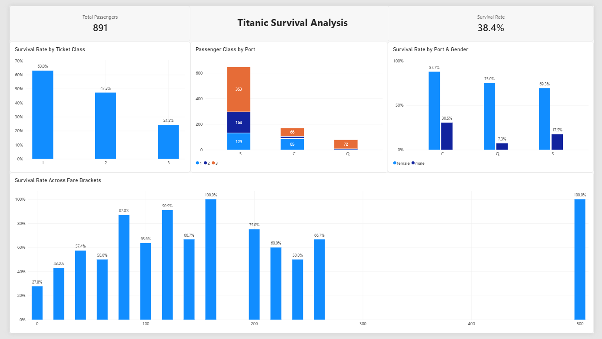

# Titanic Survival Analysis - Power BI & Excel

An exploratory analysis of the Titanic passenger dataset (891 records) exploring how ticket class, fare price, gender, and port of embarkation impacted survival rates.

---

## Dashboard Preview


---

## Key Takeaways
* **Overall Baseline:** Across the 891 passengers in the dataset, the baseline survival rate was **38.4%**.
* **Ticket Class Disparity:** Class was one of the strongest survival factors. 1st Class had a **63.0%** survival rate, 2nd Class dropped to **47.3%**, and 3rd Class had only **24.2%**.
* **Gender & Ports:** Women survived at far higher rates across every port (87.7% at Cherbourg, 75.0% at Queenstown, and 69.3% at Southampton). Men had low survival rates across the board, dropping to just 7.3% for men embarking at Queenstown.
* **Fare Impact:** Survival climbed noticeably with ticket price. Fares under $20 had survival rates below 30%, while higher fare brackets consistently reached 60%–90%. Cherbourg's higher overall survival rate was largely tied to having the highest proportion of 1st-class passengers boarding there.

---

## Process & Tools
* **Excel & Power Query:** Cleaned missing values (Age, Embarked), removed unused fields, and grouped fares into $20 bins for easier charting.
* **Power BI:** Built the report layout, tied visuals together for cross-filtering, and added summary KPIs.
* **DAX:** Wrote measures for dynamic passenger counts and survival rates.

---

## DAX Measures

```dax
// Total Passenger Count
Total Passengers = COUNTROWS('Table 1 (Titanic-Dataset)')

// Survival Rate Percentage
Survival Rate = 
DIVIDE(
    CALCULATE(COUNTROWS('Table 1 (Titanic-Dataset)'), 'Table 1 (Titanic-Dataset)'[Survived] = 1),
    COUNTROWS('Table 1 (Titanic-Dataset)'),
    0
)
```
---

## Files in this Repo
* `CleanedTitanicDataset.xlsx` — Cleaned dataset prepped in Power Query
* `TitanicCaseStudy.pbix` — Full interactive Power BI report
* `TitanicSurvivalAnalysis.png` — Dashboard view
